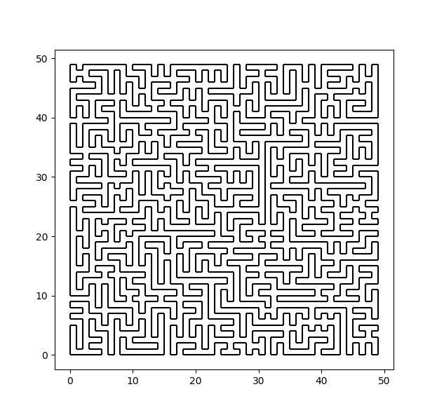

## A Very Simple Cycle Merging Hamiltonian Path Generation Algorithm



Dependencies:

- g++ (C++17)
- python
  - numpy
  - matplotlib

Usage:
```bash
make show
```

Speed (measured on my laptop):

| n | time |
|- | - |
| 10 | 0.03 ms |
| 100 | 7.17 ms |
| 500 | 1.65 s |
| 1000 | 12.3 s |
